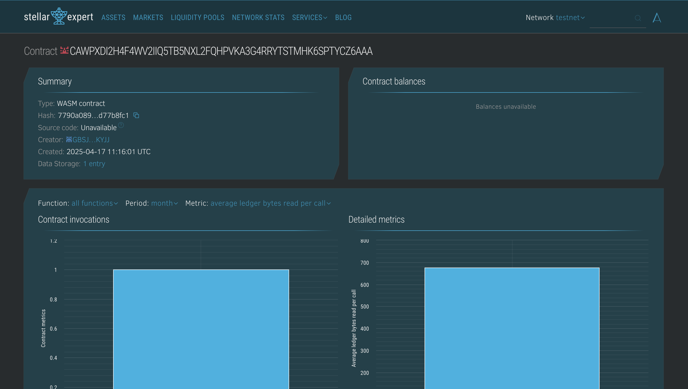

# Limited Edition NFT Sale

## Project Description
A lightweight smart contract built on the Soroban platform to facilitate the creation and sale of unique, limited-edition NFTs. Each NFT is minted with unique metadata and can only be purchased once.

## Project Vision
To empower artists and creators to securely and efficiently mint and sell digital collectibles on a decentralized platform with limited availability, ensuring exclusivity and traceable ownership.

## Key Features
- 🚀 **NFT Minting**: Mint new NFTs with a unique ID, name, and description.
- 💰 **NFT Purchase**: Users can buy NFTs, transferring ownership to themselves.
- 🔍 **NFT Details**: View metadata and ownership of any NFT by its ID.
- 📊 **Total Count**: Get the total number of NFTs minted so far.

## Future Scope
- ⛓️ Add integration with payment tokens or assets.
- 🖼️ Include NFT media file URIs and richer metadata.
- 👛 Wallet linking and transfer history tracking.
- 🛒 NFT marketplace functionality and bidding system.
# Limited Edition NFT Sale

## Project Description
A lightweight smart contract built on the Soroban platform to facilitate the creation and sale of unique, limited-edition NFTs. Each NFT is minted with unique metadata and can only be purchased once.

## Project Vision
To empower artists and creators to securely and efficiently mint and sell digital collectibles on a decentralized platform with limited availability, ensuring exclusivity and traceable ownership.

## Key Features
- 🚀 **NFT Minting**: Mint new NFTs with a unique ID, name, and description.
- 💰 **NFT Purchase**: Users can buy NFTs, transferring ownership to themselves.
- 🔍 **NFT Details**: View metadata and ownership of any NFT by its ID.
- 📊 **Total Count**: Get the total number of NFTs minted so far.

## Future Scope
- ⛓️ Add integration with payment tokens or assets.
- 🖼️ Include NFT media file URIs and richer metadata.
- 👛 Wallet linking and transfer history tracking.
- 🛒 NFT marketplace functionality and bidding system

## Contract Details
CAWPXDI2H4F4WV2IIQ5TB5NXL2FQHPVKA3G4RRYTSTMHK6SPTYCZ6AAA

